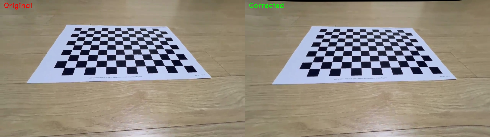
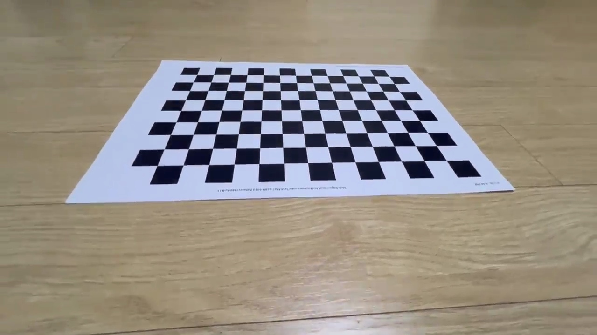
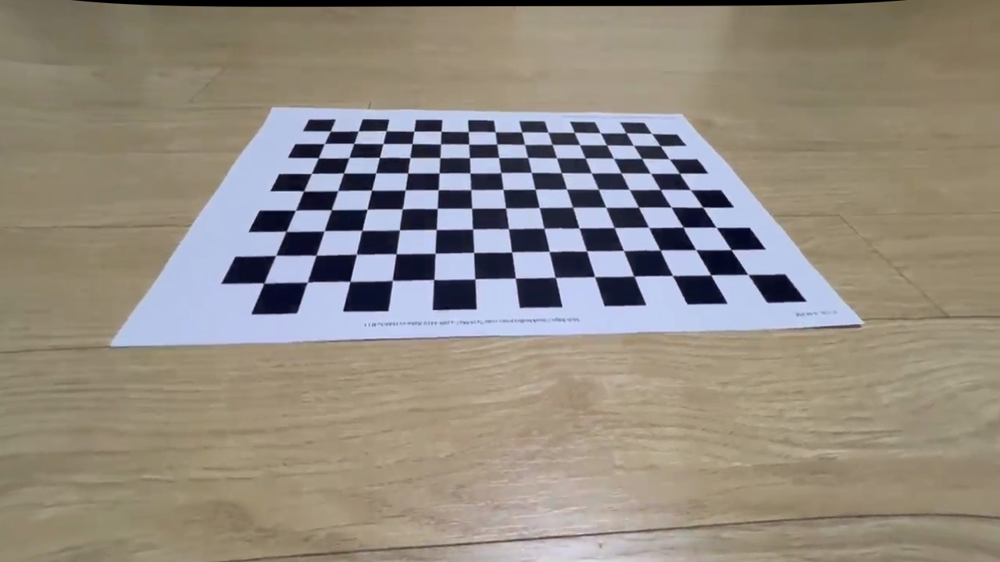

# Camera Calibration & Lens Distortion Correction

> **Description**: A camera calibration tool and lens distortion correction program using OpenCV. Calibrates intrinsic camera parameters from a chessboard pattern and applies real-time distortion correction.

---

## 1. 프로젝트 개요 (Overview)

본 프로젝트는 **OpenCV**를 활용하여 체스보드 패턴으로 카메라를 캘리브레이션하고, 렌즈 왜곡을 실시간으로 보정하는 프로그램입니다.

---

## 2. 프로젝트 구조 (Directory Structure)

```
week4/
├── camera_calibration.py      # Step 1: 카메라 캘리브레이션
├── distortion_correction.py   # Step 2: 렌즈 왜곡 보정
├── README.md
│
├── videos/                    # 핸드폰으로 촬영한 동영상 입력 폴더
│   ├── angle1.mp4             # 각도별로 여러 개 넣기
│   └── angle2.mp4
│
├── calib_images/              # [자동 생성] 동영상에서 추출된 체스보드 프레임
├── results/                   # [자동 생성] K.npy, dist.npy
└── screenshots/               # [자동 생성] 보정 전후 스크린샷
```

> `calib_images/`, `results/`, `screenshots/` 폴더는 프로그램 실행 시 **자동 생성**됩니다.

---

## 3. 주요 기능 (Key Features)

### camera_calibration.py
- **동영상 자동 처리**: `videos/` 폴더에 동영상을 넣으면 균등 간격으로 프레임 추출 후 체스보드 검출
- **세로 영상 자동 회전**: 핸드폰으로 세로 촬영한 영상도 자동으로 가로로 변환하여 처리
- **3가지 입력 모드 자동 감지**: 동영상 → 이미지 → 웹캠 순으로 자동 선택
- **캘리브레이션 품질 평가**: RMS 재투영 오차로 자동 평가 및 결과 저장

### distortion_correction.py
- `camera_calibration.py`로 구한 K, dist_coeff를 바탕으로 실시간 왜곡 보정
- `Space` 키로 보정 전/후를 즉시 비교 가능
- `s` 키로 현재 화면 스크린샷 저장

---

## 4. 동영상 촬영 가이드 (How to Record Videos)

> 캘리브레이션 품질은 촬영 방법에 크게 좌우됩니다.

### ✅ 올바른 촬영 방법

| 항목 | 내용 |
|------|------|
| **체스보드 크기** | 화면의 **50% 이상** 차지하도록 가까이 촬영 |
| **촬영 각도** | 정면 + 상하좌우 기울임 + 대각선 등 **다양한 각도** |
| **영상 수** | 각도별로 **여러 개** 나눠서 촬영 (angle1.mp4, angle2.mp4 ...) |
| **영상 길이** | 동영상 1개당 **10~15초** 이상 |
| **움직임** | 천천히 부드럽게 이동 — 흔들림 최소화 |
| **조명** | 밝은 곳에서 촬영, 직사광선 반사 주의 |
| **방향** | 세로/가로 모두 가능 (자동 회전 처리) |

### ❌ 피해야 할 촬영

- 체스보드가 화면에 작게 찍히는 것
- 카메라-보드가 완전 평행인 영상만 찍는 것 (원근 정보 부족)
- 빠르게 움직여 흔들림이 심한 영상
- 체스보드 전체가 화면에서 잘리는 경우

---

## 5. 실행 방법 (Setup & Run)

```bash
# 필수 라이브러리 설치
pip install numpy opencv-python

# 1. videos/ 폴더에 동영상 넣기
mkdir videos
# 핸드폰으로 촬영한 mp4/mov 파일을 videos/ 에 복사

# Step 1: 카메라 캘리브레이션
python camera_calibration.py

# Step 2: 렌즈 왜곡 보정
python distortion_correction.py
```

### 입력 모드 자동 선택

| 상황 | 동작 |
|------|------|
| `videos/` 에 동영상 있음 | 동영상에서 프레임 자동 추출 후 캘리브레이션 |
| `calib_images/` 에 이미지 있음 | 이미지 파일 직접 사용 |
| 둘 다 없음 | 실시간 웹캠 캡처 모드 |

---

## 6. 조작 가이드 (Controls)

### camera_calibration.py (웹캠 모드일 때)

| 키 | 기능 |
|----|------|
| **Space** | 체스보드 검출 성공 시 현재 프레임 캡처 |
| **Enter** | 캘리브레이션 실행 (최소 10장 이상 후) |
| **ESC** | 프로그램 종료 |

### distortion_correction.py

| 키 | 기능 |
|----|------|
| **Space** | 보정 ON/OFF 토글 (원본 ↔ 보정 비교) |
| **s** | 현재 화면 스크린샷 저장 |
| **ESC** | 프로그램 종료 |

---

## 7. 캘리브레이션 결과 (Calibration Results)

| 파라미터 | 값 |
|---------|-----|
| **fx** | 579.8358 |
| **fy** | 580.0895 |
| **cx** | 640.0014 |
| **cy** | 353.2502 |
| **k1** | 0.001415 |
| **k2** | 0.016521 |
| **p1** | -0.001870 |
| **p2** | -0.001837 |
| **k3** | -0.026584 |
| **RMS Error** | 0.435027 px |

---

## 8. 왜곡 보정 결과 (Distortion Correction Demo)

### 보정 전/후 비교 (Compare)


### 보정 전 (Original)


### 보정 후 (Corrected)
